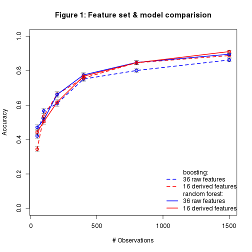
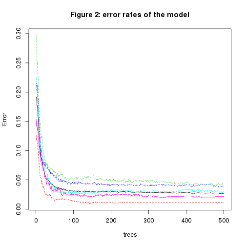

Prediction of physical exercise performance using accelerometer data
====

Summary
---
The quantified self movement aims at collecting large amounts of data about the individual's activities. 
These data are usually used to quantify which and how much of a particular activity is done, 
but they can also be used to measure how well certain activities are done, e.g. for training purposes.

To generate data for this analysis six male healthy participants (20-28 years) 
performed repetitions of the Unilateral Dumbbell Biceps Curl 
in five different ways: 
exactly according to the specification (Class A), 
throwing the elbows to the front (Class B), 
lifting the dumbbell only halfway (Class C), 
lowering the dumbbell only halfway (Class D) and 
throwing the hips to the front (Class E).
The data was recorded by sensors placed at four locations: 
arm, forearm, belt, dumbell (for detailed information see references 1 and 2).

Here, we develop a machine learning algorithm to predict if weight lifting exercises are
performed correctly (Class A) or if errors occur during the exercise (Classes B to E).
We compare a boosting and a random forest approach.
We decide for the random forest and use a selected set of 16 features.
We estimate the out of sample error of our model to be about 3%.


[Resource: Human Activity Recognition](http://groupware.les.inf.puc-rio.br/har)

Data Preprocessing
---
Before starting the analysis, the data is loaded and divided into training (60%), validation (20%),
and testing set (20%). 
The validation set is used to evaluate the performance of different feature sets
and to select the optimal conditions.
The testing set is only used in the end to estimate the accuracy and error rate of the final model.

Although [for random forests, there is no need for cross-validation or a separate test set to get 
an unbiased estimate of the test set error](http://www.stat.berkeley.edu/~breiman/RandomForests/cc_home#ooberr)
we nevertheless generate an independent testing set since we want to be able to compare different kinds of models, 
and the remaining training set size of 60% of the original data is still bigger than what we can handle with our
computational resources.


```r
library(caret)
```

```
## Loading required package: lattice
## Loading required package: ggplot2
```

```r
library(e1071)
library(plyr)
library(randomForest)
```

```
## randomForest 4.6-10
## Type rfNews() to see new features/changes/bug fixes.
```

```r
library(gbm)
```

```
## Loading required package: survival
## Loading required package: splines
## 
## Attaching package: 'survival'
## 
## The following object is masked from 'package:caret':
## 
##     cluster
## 
## Loading required package: parallel
## Loaded gbm 2.1
```

```r
set.seed(1234)

data <- read.csv("pml-training.csv")
cols <- names(data)

inTrain <- createDataPartition(y=data$classe, p=0.6, list=F)
training <- data[inTrain,]
testing  <- data[-inTrain,]

# split the testing set into a validation and a final testing set
inTest <- createDataPartition(y=testing$classe, p=0.5, list=F)
validate <- testing[-inTest,]
testing  <- testing[inTest,]
```
Visual inspection of the training set indicates that there are many missing values in several columns
(e.g. column names starting with `avg_`, `stddev_`, `var_`).
We exclude these from our model building efforts.

Machine Learning
---
In a related work (reference 1) a random forest approach was used successfully to distinguish between
the different classes of exercises. Hence, we decided to use a random forest model here as well and 
compare it to a boosting model.

Due to limitations in computing resources only a limited set of observations and 
features can be used to perform this analysis.

Therefore, we first create two non-overlapping feature sets from the four sensors
and analyse their performance:
raw data features (`features1`: 36 features ending with `_x`, `_y`, `_z`)
and "derived" features (`features2`: 16 features starting with `roll_`, `pitch_`, `yaw_`, `total_accel_`).
For each feature set, we repeatedly train a boosting and a random forest model using increasing numbers of observations 
and analyse the accuracy using the validation set (Figure 1).


```r
cmp_features <- function(model, features, range, ...) {
    valid_feat <- subset(validate, select=features)
    accuracy <- vector()
    for (i in range) {
        train_feat <- training[sample(1:dim(training)[1], i, replace=F), features]
        duration <- system.time(
            modelFit <- train(classe ~ ., method=model, data=train_feat, ...))
#        print(c(model=model, samplesize=i, round(duration["elapsed"],1)))
        cM <- confusionMatrix(valid_feat$classe, predict(modelFit, valid_feat))
        accuracy <- rbind(accuracy, c(cM$overall[c("Accuracy","AccuracyLower","AccuracyUpper")]))
        }
    return(accuracy)
    }

range <- c(50,100,200,400,800,1500)

features1 <- grep("_x$|_y$|_z$", cols)
acc1 <- cmp_features("gbm", c("classe", cols[features1]), range, verbose=F)
acc3 <- cmp_features("rf", c("classe", cols[features1]), range)

features2 <- grep("^roll_|^pitch_|^yaw_|^total_accel", cols)
acc2 <- cmp_features("gbm", c("classe", cols[features2]), range, verbose=F)
acc4 <- cmp_features("rf", c("classe", cols[features1]), range)

#Figure 1
plot(range, acc1[,"Accuracy"], col="blue", type="o", lwd=2, lty=2, ylim=c(0,1), 
     xlab="# Observations", ylab="Accuracy", main="Figure 1: Feature set & model comparision")
arrows(range, acc1[,"AccuracyLower"], range, acc1[,"AccuracyUpper"], angle=90, code=3, length=0.06, lwd=0.5)
lines(range, acc2[,"Accuracy"], col="red", type="o", lwd=2, lty=2)
arrows(range, acc2[,"AccuracyLower"], range, acc2[,"AccuracyUpper"], angle=90, code=3, length=0.06, lwd=0.5)
lines(range, acc3[,"Accuracy"], col="blue", type="o", lwd=2)
arrows(range, acc3[,"AccuracyLower"], range, acc3[,"AccuracyUpper"], angle=90, code=3, length=0.06, lwd=0.5)
lines(range, acc4[,"Accuracy"], col="red", type="o", lwd=2)
arrows(range, acc4[,"AccuracyLower"], range, acc4[,"AccuracyUpper"], angle=90, code=3, length=0.06, lwd=0.5)
legend("bottomright", c("boosting:", "36 raw features","16 derived features",
                        "random forest:", "36 raw features","16 derived features"), 
       col=c(NA,"blue","red"), lwd=2, lty=c(NA,2,2,NA,1,1), bty="n")
```

 

Our analysis shows that the set of 16 features performs better than the set of 36 raw features for larger sample sizes.
Furthermore the random forest seems to perform slightly better than boosting.
We therefore use these 16 features together with a random sample of 5000 observations from the
training set to generate our final prediction model. Again, the choice of taking only 5000 observations is 
due to limited computing resources.
With the testing data set we estimate the accuracy of our final model.


```r
train_feat <- training[sample(1:dim(training)[1], 5000, replace=F), c("classe", cols[features2])]
test_feat <- subset(testing, select=c("classe", cols[features2]))

modelFit <- train(classe ~ ., method="rf", data=train_feat, verbose=F)
modelFit
```

```
## Random Forest 
## 
## 5000 samples
##   16 predictor
##    5 classes: 'A', 'B', 'C', 'D', 'E' 
## 
## No pre-processing
## Resampling: Bootstrapped (25 reps) 
## 
## Summary of sample sizes: 5000, 5000, 5000, 5000, 5000, 5000, ... 
## 
## Resampling results across tuning parameters:
## 
##   mtry  Accuracy  Kappa  Accuracy SD  Kappa SD
##    2    1.0       1.0    0.005        0.006   
##    9    1.0       0.9    0.005        0.006   
##   16    0.9       0.9    0.007        0.008   
## 
## Accuracy was used to select the optimal model using  the largest value.
## The final value used for the model was mtry = 2.
```

```r
modelFit$finalModel
```

```
## 
## Call:
##  randomForest(x = x, y = y, mtry = param$mtry, verbose = ..1) 
##                Type of random forest: classification
##                      Number of trees: 500
## No. of variables tried at each split: 2
## 
##         OOB estimate of  error rate: 2.68%
## Confusion matrix:
##      A   B   C   D   E class.error
## A 1403   5   2   7   2     0.01128
## B   19 935  16   1   5     0.04201
## C    0  19 810  13   0     0.03800
## D    0   1  23 815   1     0.02976
## E    2   3   5  10 903     0.02167
```

```r
#Figure 2
plot(modelFit$finalModel, main="Figure 2: error rates of the model")
```

 

```r
cM <- confusionMatrix(test_feat$classe, predict(modelFit, test_feat))
cM
```

```
## Confusion Matrix and Statistics
## 
##           Reference
## Prediction    A    B    C    D    E
##          A 1111    2    1    2    0
##          B   21  710   22    5    1
##          C    0   17  653   14    0
##          D    1    0   19  620    3
##          E    1    3    6   10  701
## 
## Overall Statistics
##                                         
##                Accuracy : 0.967         
##                  95% CI : (0.961, 0.973)
##     No Information Rate : 0.289         
##     P-Value [Acc > NIR] : < 2e-16       
##                                         
##                   Kappa : 0.959         
##  Mcnemar's Test P-Value : 0.000116      
## 
## Statistics by Class:
## 
##                      Class: A Class: B Class: C Class: D Class: E
## Sensitivity             0.980    0.970    0.932    0.952    0.994
## Specificity             0.998    0.985    0.990    0.993    0.994
## Pos Pred Value          0.996    0.935    0.955    0.964    0.972
## Neg Pred Value          0.992    0.993    0.985    0.991    0.999
## Prevalence              0.289    0.187    0.179    0.166    0.180
## Detection Rate          0.283    0.181    0.166    0.158    0.179
## Detection Prevalence    0.284    0.193    0.174    0.164    0.184
## Balanced Accuracy       0.989    0.977    0.961    0.973    0.994
```
The accuracy of our final model is about 97% and 
the estimated out of sample error rate is 3%.
Including more observations and features could probably improve the model further.

Performance Prediction
---
Finally, we apply our model to another test data set where the correct solutions are not known.
Our predictions are:

```r
pml_write_files = function(x){
    n = length(x)
    for(i in 1:n){
        filename = paste0("problem_id_",i,".txt")
        write.table(x[i],file=filename,quote=FALSE,row.names=FALSE,col.names=FALSE)
        }
    }
final_pred <- read.csv("pml-testing.csv")
answers <- predict(modelFit, final_pred[,cols[features2]])
pml_write_files(answers)
rbind(probelm_id=1:20, prediction=as.character(answers))
```

```
##            [,1] [,2] [,3] [,4] [,5] [,6] [,7] [,8] [,9] [,10] [,11] [,12]
## probelm_id "1"  "2"  "3"  "4"  "5"  "6"  "7"  "8"  "9"  "10"  "11"  "12" 
## prediction "B"  "A"  "B"  "A"  "A"  "E"  "D"  "B"  "A"  "A"   "B"   "C"  
##            [,13] [,14] [,15] [,16] [,17] [,18] [,19] [,20]
## probelm_id "13"  "14"  "15"  "16"  "17"  "18"  "19"  "20" 
## prediction "B"   "A"   "E"   "E"   "A"   "B"   "B"   "B"
```

References
---
1. Velloso, E.; Bulling, A.; Gellersen, H.; Ugulino, W.; Fuks, H. 
[Qualitative Activity Recognition of Weight Lifting Exercises](http://groupware.les.inf.puc-rio.br/work.jsf?p1=11201).
Proceedings of 4th International Conference in Cooperation with SIGCHI (Augmented Human '13) . Stuttgart, Germany: ACM SIGCHI, 2013.
2. website [Human Activity Recognition](http://groupware.les.inf.puc-rio.br/har)

